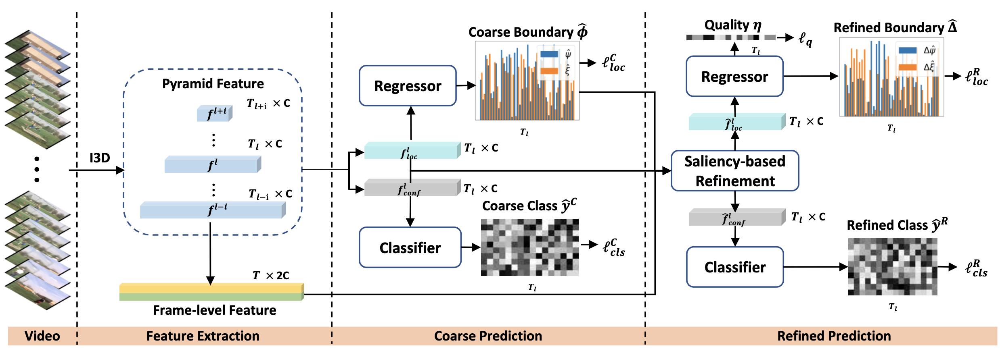
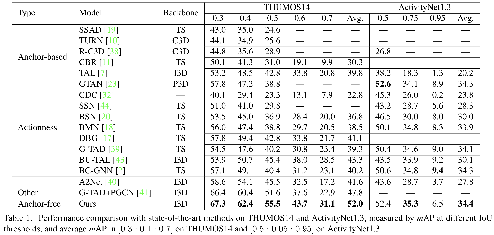

# AFSD: Learning Salient Boundary Feature for Anchor-free Temporal Action Localization
This is an official implementation in PyTorch of AFSD. Our paper is available at https://arxiv.org/abs/2103.13137




## Updates
- (May, 2021) Release training and inference code for ActivityNet v1.3: [\[ANET_README\]](AFSD/anet/README.md)
- (May, 2021) We released AFSD training and inference code for THUMOS14 dataset.
- (February, 2021) AFSD is accepted by CVPR2021.

## Abstract
Temporal action localization is an important yet challenging task in video understanding. Typically, such a task aims at inferring both the action category and localization of the start and end frame for each action instance in a long, untrimmed video.
While most current models achieve good results by using pre-defined anchors and numerous actionness, such methods could be bothered with both large number of outputs and heavy tuning of locations and sizes corresponding to different anchors. Instead, anchor-free methods is lighter, getting rid of redundant hyper-parameters, but gains few attention. In this paper, we propose the first purely anchor-free temporal localization method, which is both efficient and effective. Our model includes (i) an end-to-end trainable basic predictor, 
(ii) a saliency-based refinement module to gather more valuable boundary features for each proposal with a novel boundary pooling, and (iii) several consistency constraints to make sure our model can find the accurate boundary given arbitrary proposals. Extensive experiments show that our method beats all anchor-based and actionness-guided methods with a remarkable margin on THUMOS14, achieving state-of-the-art results, and comparable ones on ActivityNet v1.3.

## Summary
- First purely anchor-free framework for temporal action detection task.
- Fully end-to-end method using frames as input rather then features.
- Saliency-based refinement module to gather more valuable boundary features.
- Boundary consistency learning to make sure our model can find the accurate boundary.

## Performance


## Getting Started

### Environment
- Python 3.7
- PyTorch == 1.4.0 **(Please make sure your pytorch version is 1.4)**
- NVIDIA GPU

### Setup
```shell script
pip3 install -r requirements.txt
python3 setup.py develop
```
### Data Preparation
- **THUMOS14 RGB data:**
1. Download pre-processed RGB npy data (13.7GB): [\[Weiyun\]](https://share.weiyun.com/bP62lmHj)
2. Unzip the RGB npy data to `./datasets/thumos14/validation_npy/` and `./datasets/thumos14/test_npy/`

- **THUMOS14 flow data:**
1. Because it costs more time to generate flow data for THUMOS14, to make easy to run flow model, we provide the pre-processed flow data in Google Drive and Weiyun (3.4GB):
[\[Google Drive\]](https://drive.google.com/file/d/1e-6JX-7nbqKizQLHsi7N_gqtxJ0_FLXV/view?usp=sharing),
[\[Weiyun\]](https://share.weiyun.com/uHtRwrMb)  
2. Unzip the flow npy data to `./datasets/thumos14/validation_flow_npy/` and `./datasets/thumos14/test_flow_npy/`


**If you want to generate npy data by yourself, please refer to the following guidelines:**

- **RGB data generation manually:**
1. To construct THUMOS14 RGB npy inputs, please download the THUMOS14 training and testing videos.  
Training videos: https://storage.googleapis.com/thumos14_files/TH14_validation_set_mp4.zip  
Testing videos: https://storage.googleapis.com/thumos14_files/TH14_Test_set_mp4.zip  
(unzip password is `THUMOS14_REGISTERED`)  
2. Move the training videos to `./datasets/thumos14/validation/` and the testing videos to `./datasets/thumos14/test/`
3. Run the data processing script: `python3 AFSD/common/video2npy.py configs/thumos14.yaml`

- **Flow data generation manually:**
1. If you should generate flow data manually, firstly install the [denseflow](https://github.com/open-mmlab/denseflow).
2. Prepare the pre-processed RGB data.
3. Check and run the script: `python3 AFSD/common/gen_denseflow_npy.py configs/thumos14_flow.yaml`

### Inference
We provide the pretrained models contain I3D backbone model and final RGB and flow models for THUMOS14 dataset:
[\[Google Drive\]](https://drive.google.com/drive/folders/1IG51-hMHVsmYpRb_53C85ISkpiAHfeVg?usp=sharing),
[\[Weiyun\]](https://share.weiyun.com/ImV5WYil)
```shell script
# run RGB model
python3 AFSD/thumos14/test.py configs/thumos14.yaml --checkpoint_path=models/thumos14/checkpoint-15.ckpt --output_json=thumos14_rgb.json

# run flow model
python3 AFSD/thumos14/test.py configs/thumos14_flow.yaml --checkpoint_path=models/thumos14_flow/checkpoint-16.ckpt --output_json=thumos14_flow.json

# run fusion (RGB + flow) model
python3 AFSD/thumos14/test.py configs/thumos14.yaml --fusion --output_json=thumos14_fusion.json
```

### Evaluation
The output json results of pretrained model can be downloaded from: [\[Google Drive\]](https://drive.google.com/drive/folders/10VCWQi1uXNNpDKNaTVnn7vSD9YVAp8ut?usp=sharing),
[\[Weiyun\]](https://share.weiyun.com/R7RXuFFW)
```shell script
# evaluate THUMOS14 fusion result as example
python3 AFSD/thumos14/eval.py output/thumos14_fusion.json

mAP at tIoU 0.3 is 0.6728296149479254
mAP at tIoU 0.4 is 0.6242590551201842
mAP at tIoU 0.5 is 0.5546668739091394
mAP at tIoU 0.6 is 0.4374840824921885
mAP at tIoU 0.7 is 0.3110112542745055
```

### Training
```shell script
# train the RGB model
python3 AFSD/thumos14/train.py configs/thumos14.yaml --lw=10 --cw=1 --piou=0.5

# train the flow model
python3 AFSD/thumos14/train.py configs/thumos14_flow.yaml --lw=10 --cw=1 --piou=0.5
```
### 

## Citation
If you find this project useful for your research, please use the following BibTeX entry.
```
@InProceedings{Lin_2021_CVPR,
    author    = {Lin, Chuming and Xu, Chengming and Luo, Donghao and Wang, Yabiao and Tai, Ying and Wang, Chengjie and Li, Jilin and Huang, Feiyue and Fu, Yanwei},
    title     = {Learning Salient Boundary Feature for Anchor-free Temporal Action Localization},
    booktitle = {Proceedings of the IEEE/CVF Conference on Computer Vision and Pattern Recognition (CVPR)},
    month     = {June},
    year      = {2021},
    pages     = {3320-3329}
}
```
